# Cahier UML - VLogger
## Projet de Logger API Open Source

**Version:** 1.0.0  
**Date:** 30 Janvier 2026  
**Auteur:** Votre Équipe  

---

## Table des Matières

1. [Vue d'ensemble du projet](#1-vue-densemble-du-projet)
2. [Diagramme de cas d'utilisation](#2-diagramme-de-cas-dutilisation)
3. [Diagramme de classes](#3-diagramme-de-classes)
4. [Diagramme de séquence](#4-diagramme-de-séquence)
5. [Diagramme d'activité](#5-diagramme-dactivité)
6. [Diagramme de composants](#6-diagramme-de-composants)
7. [Diagramme de déploiement](#7-diagramme-de-déploiement)
8. [Diagramme d'état](#8-diagramme-détat)
9. [Modèle de données](#9-modèle-de-données)
10. [Architecture technique](#10-architecture-technique)

---

## 1. Vue d'ensemble du projet

### 1.1 Description

VLogger est un outil open source de monitoring et de documentation automatique pour APIs. Il permet aux développeurs de :
- Capturer automatiquement toutes les requêtes/réponses HTTP
- Générer une documentation API vivante
- Analyser les performances
- Visualiser les logs via un dashboard intégré

### 1.2 Caractéristiques principales

- **Gratuit & Open Source** : Aucun compte requis, pas d'API key
- **Installation simple** : Un seul fichier à copier
- **Configuration flexible** : Fichiers JSON/INI
- **Stockage local** : Les données restent sur la machine du développeur
- **Dashboard intégré** : Interface web temps réel
- **Multi-langage** : Node.js, Python (extensible)

### 1.3 Acteurs du système

- **Développeur** : Utilise VLogger dans son projet
- **Application** : Le projet du développeur qui intègre VLogger
- **VLogger Core** : Le middleware qui intercepte les requêtes
- **Système de stockage** : Fichiers JSON locaux
- **Dashboard** : Interface web de visualisation

---

## 2. Diagramme de cas d'utilisation

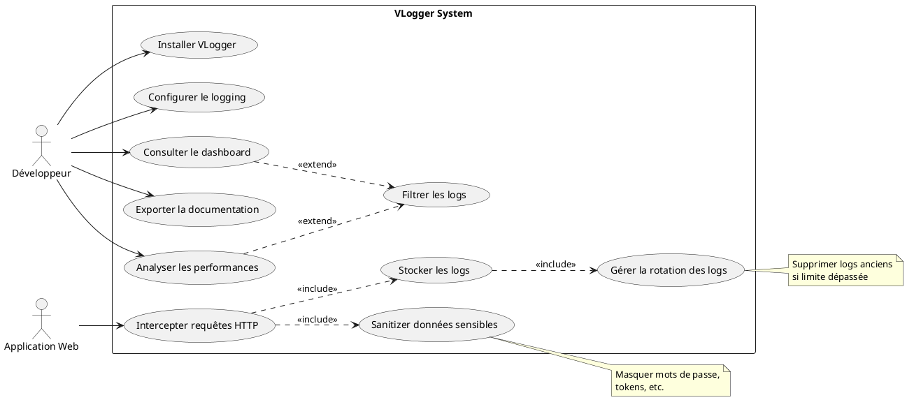

### 2.1 Description des cas d'utilisation

| ID | Cas d'utilisation | Description | Acteur principal |
|----|-------------------|-------------|------------------|
| UC1 | Installer VLogger | Télécharger et copier vlogger.js dans le projet | Développeur |
| UC2 | Configurer le logging | Créer vlogger.config.json et vlogger.info | Développeur |
| UC3 | Intercepter requêtes HTTP | Capturer automatiquement req/res via middleware | Application |
| UC4 | Stocker les logs | Sauvegarder dans des fichiers JSON datés | Système |
| UC5 | Consulter le dashboard | Visualiser stats et logs en temps réel | Développeur |
| UC6 | Exporter la documentation | Générer doc Markdown/PDF | Développeur |
| UC7 | Analyser les performances | Voir temps de réponse, erreurs, etc. | Développeur |
| UC8 | Filtrer les logs | Exclure certains endpoints ou fichiers statiques | Développeur |
| UC9 | Sanitizer données sensibles | Masquer automatiquement passwords, tokens | Système |
| UC10 | Gérer la rotation des logs | Supprimer vieux fichiers selon config | Système |

---

## 3. Diagramme de classes

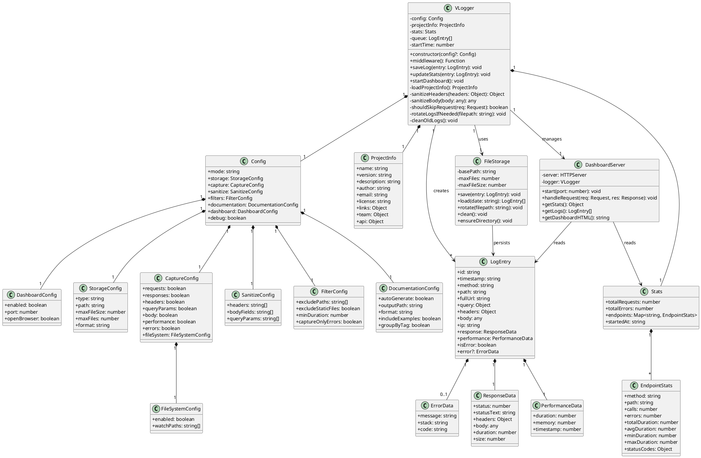

---

## 4. Diagramme de séquence

### 4.1 Séquence d'interception d'une requête

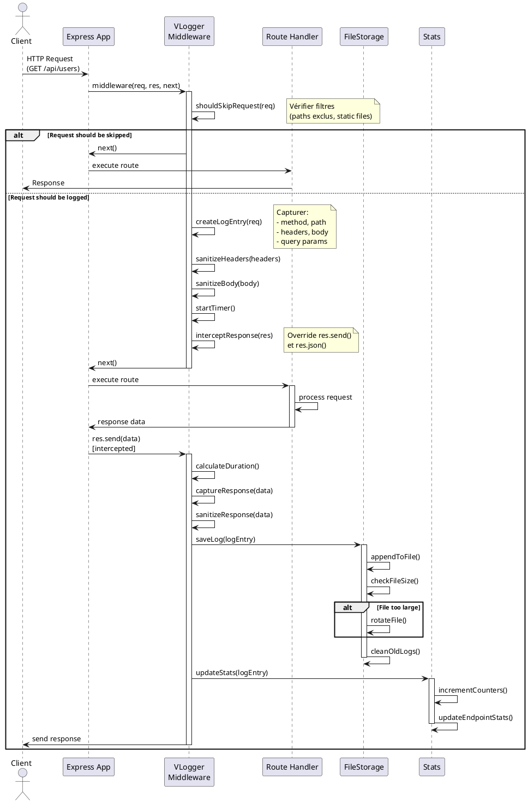

### 4.2 Séquence de consultation du dashboard

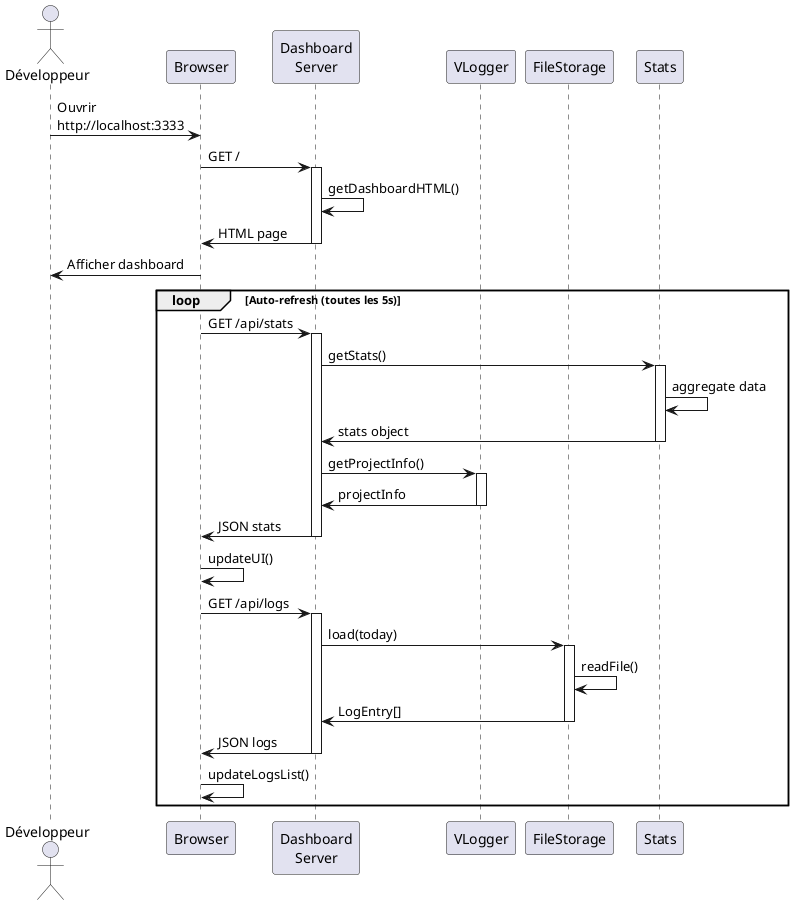

### 4.3 Séquence d'installation

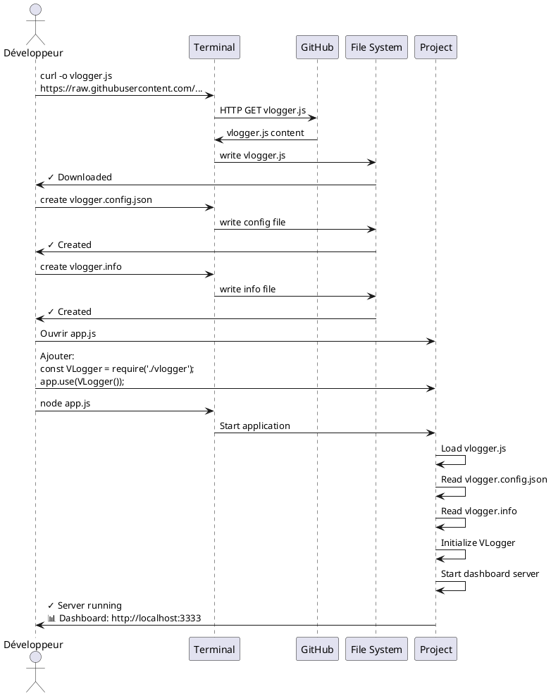

---

## 5. Diagramme d'activité

### 5.1 Activité de traitement d'une requête

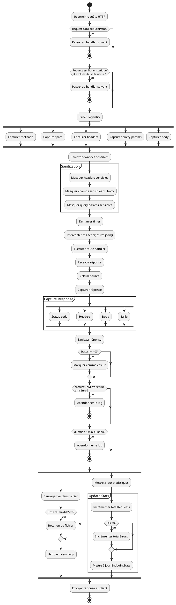

### 5.2 Activité de rotation des logs

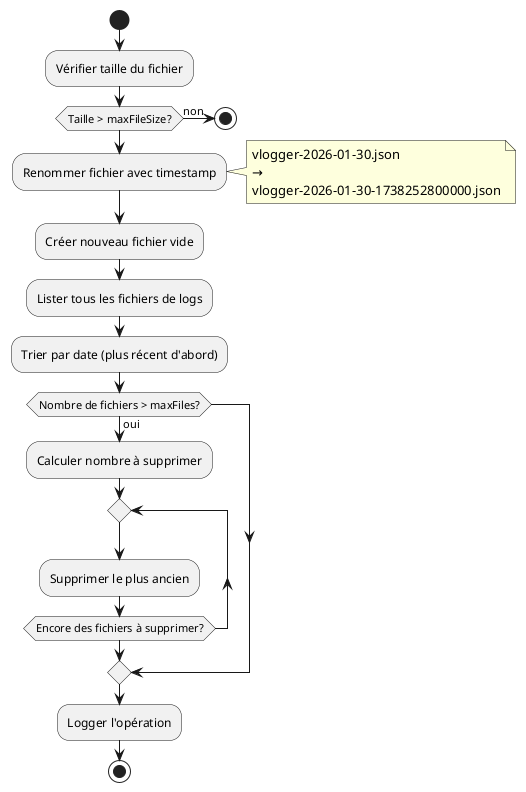

---

## 6. Diagramme de composants

```plantuml
@startuml
package "VLogger System" {
  
  component [vlogger.js] as Core {
    component [VLogger Class] as VLoggerClass
    component [Middleware] as Middleware
    component [Config Loader] as ConfigLoader
    component [Sanitizer] as Sanitizer
    component [Logger] as Logger
  }
  
  component [Dashboard Server] as Dashboard {
    component [HTTP Server] as HTTPServer
    component [API Routes] as APIRoutes
    component [HTML Generator] as HTMLGen
  }
  
  component [File Storage] as Storage {
    component [File Writer] as Writer
    component [File Reader] as Reader
    component [Rotator] as Rotator
  }
  
  component [Stats Manager] as StatsManager {
    component [Counter] as Counter
    component [Aggregator] as Aggregator
  }
  
}

component [vlogger.config.json] as Config
component [vlogger.info] as Info

package "User Application" {
  component [Express App] as App
  component [Route Handlers] as Handlers
}

database "File System" {
  folder "logs/" {
    [vlogger-YYYY-MM-DD.json]
  }
  folder "docs/" {
    [api.md]
  }
}

' Relations
App --> Middleware : use
Middleware --> VLoggerClass : delegates to
VLoggerClass --> ConfigLoader : loads config
VLoggerClass --> Sanitizer : sanitizes data
VLoggerClass --> Logger : logs entries

ConfigLoader ..> Config : reads
ConfigLoader ..> Info : reads

Logger --> Storage : saves logs
Storage --> Writer : writes
Storage --> Reader : reads
Storage --> Rotator : rotates

Logger --> StatsManager : updates stats
StatsManager --> Counter : increments
StatsManager --> Aggregator : aggregates

VLoggerClass --> Dashboard : starts
Dashboard --> HTTPServer : creates
HTTPServer --> APIRoutes : handles
APIRoutes --> StatsManager : queries
APIRoutes --> Storage : queries
APIRoutes --> HTMLGen : generates

Writer --> [vlogger-YYYY-MM-DD.json] : writes
Reader --> [vlogger-YYYY-MM-DD.json] : reads

note right of Dashboard
  Port 3333 par défaut
  API REST + WebUI
end note

note bottom of Storage
  Stockage local
  Format JSON
  Rotation automatique
end note

@enduml
```

---

## 7. Diagramme de déploiement

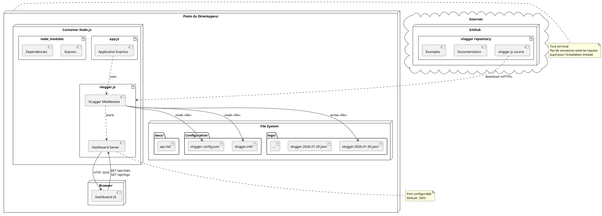

---

## 8. Diagramme d'état

### 8.1 États de VLogger

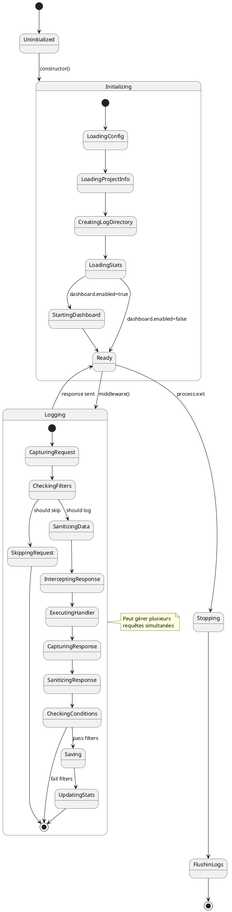

### 8.2 États d'un fichier de log

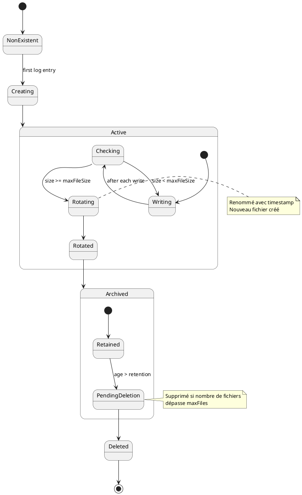

---

## 9. Modèle de données

### 9.1 Structure des fichiers JSON

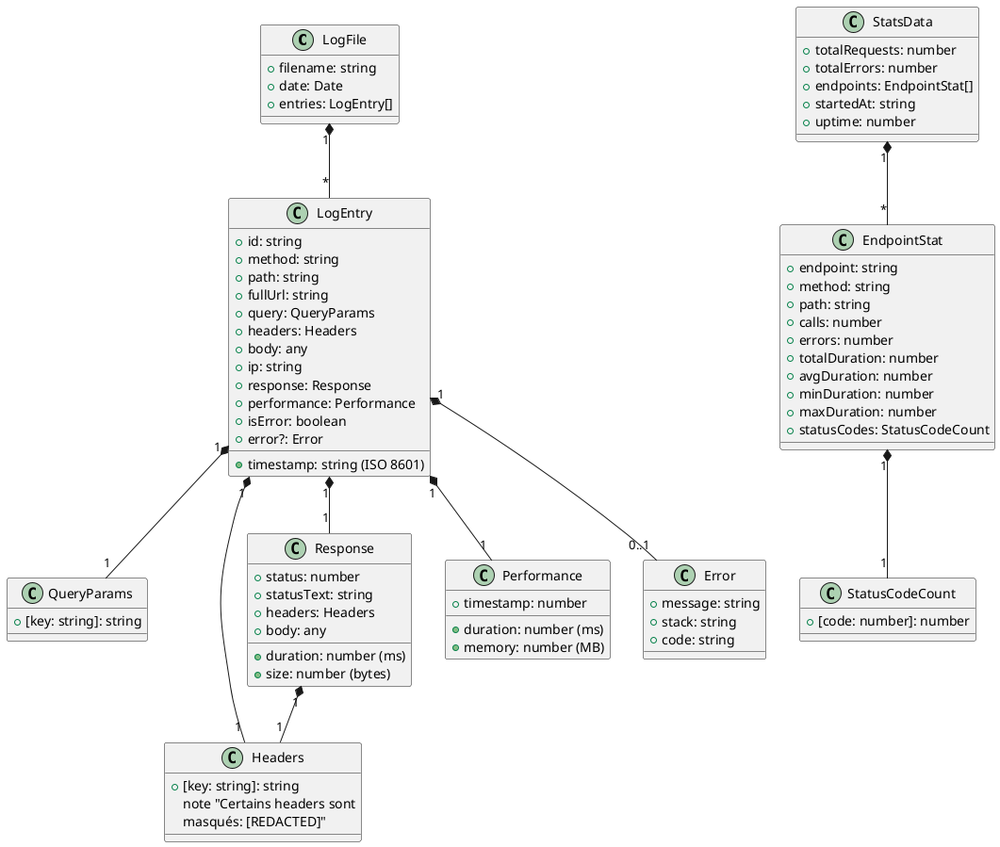

### 9.2 Exemple de données JSON

**Fichier: logs/vlogger-2026-01-30.json**
```json
[
  {
    "id": "1738252800000-abc123xyz",
    "timestamp": "2026-01-30T10:30:15.234Z",
    "method": "POST",
    "path": "/api/users",
    "fullUrl": "http://localhost:3000/api/users",
    "query": {},
    "headers": {
      "content-type": "application/json",
      "user-agent": "Mozilla/5.0...",
      "authorization": "[REDACTED]"
    },
    "body": {
      "name": "John Doe",
      "email": "john@example.com",
      "password": "[REDACTED]"
    },
    "ip": "::1",
    "response": {
      "status": 201,
      "statusText": "Created",
      "headers": {
        "content-type": "application/json"
      },
      "body": {
        "id": 123,
        "name": "John Doe",
        "email": "john@example.com"
      },
      "duration": 87,
      "size": 156
    },
    "performance": {
      "duration": 87,
      "memory": 23.5,
      "timestamp": 1738252800087
    },
    "isError": false
  }
]
```

---

## 10. Architecture technique

### 10.1 Stack technologique

| Composant | Technologie | Version | Justification |
|-----------|-------------|---------|---------------|
| Runtime | Node.js | 18+ | Écosystème mature, async natif |
| Langage | JavaScript | ES6+ | Pas de compilation, compatible navigateurs |
| Serveur HTTP | http (natif) | - | Léger, pas de dépendance externe |
| Stockage | File System | - | Simple, local, pas de DB externe |
| Format données | JSON | - | Standard, lisible, facilement parsable |
| Dashboard | HTML/CSS/JS | - | Aucune dépendance front-end |

### 10.2 Architecture en couches

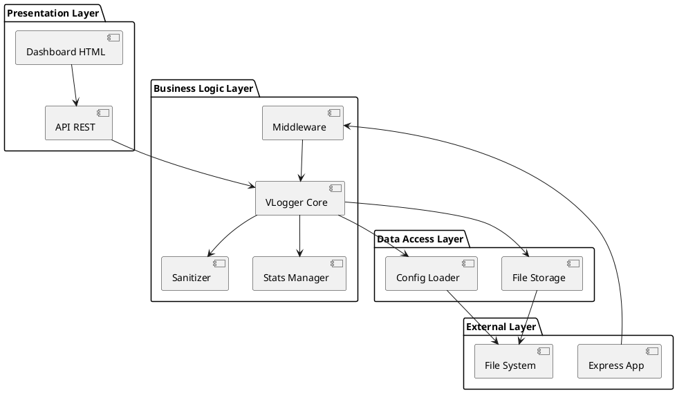

### 10.3 Flux de données

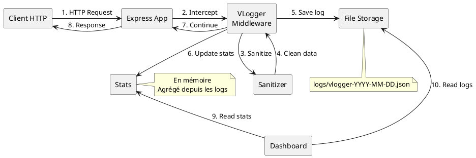

### 10.4 Patterns de conception utilisés

| Pattern | Utilisation | Bénéfice |
|---------|-------------|----------|
| **Middleware** | Interception des requêtes HTTP | Séparation des responsabilités |
| **Singleton** | Instance unique de VLogger | Cohérence des stats |
| **Strategy** | Différentes stratégies de sanitization | Extensibilité |
| **Observer** | Mise à jour temps réel du dashboard | Réactivité |
| **Factory** | Création des LogEntry | Encapsulation |
| **Decorator** | Interception de res.send() | Extension sans modification |

### 10.5 Gestion de la concurrence

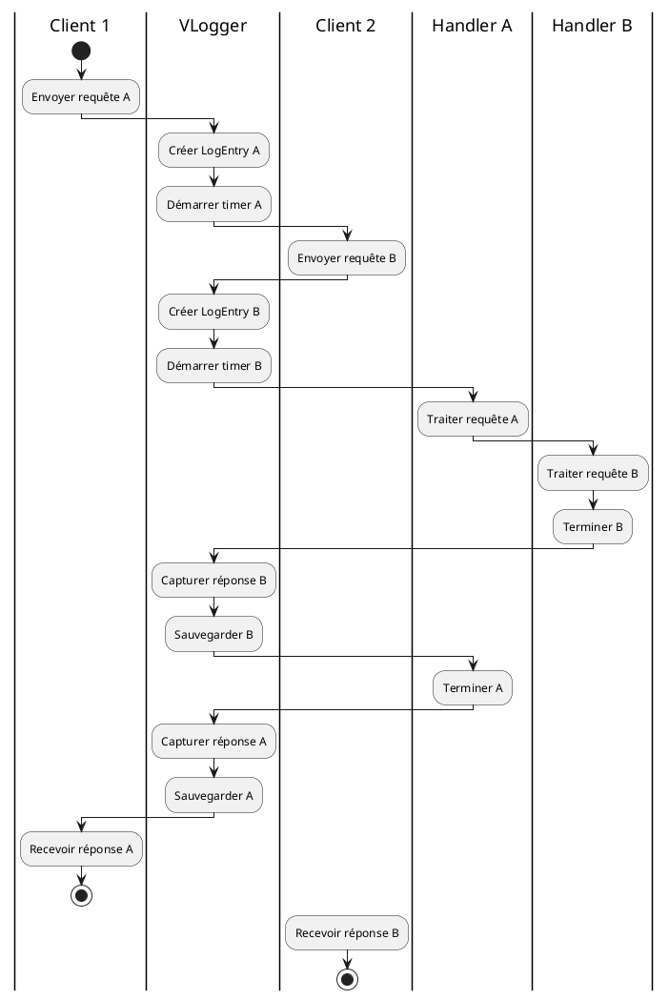

**Note:** Node.js gère naturellement la concurrence via son event loop. Les opérations I/O (écriture fichier) sont asynchrones.

### 10.6 Sécurité

| Aspect | Implémentation | Protection contre |
|--------|----------------|-------------------|
| **Sanitization** | Masquage automatique | Fuite de credentials |
| **Stockage local** | Pas de transmission réseau | Interception MITM |
| **Configuration** | Fichiers locaux | Injection de config |
| **Dashboard** | Localhost only | Accès externe non autorisé |
| **Validation** | Type checking | Injection de code |

### 10.7 Performance

**Optimisations implémentées:**

1. **Écriture par batch** : Évite trop d'I/O
2. **Rotation automatique** : Limite la taille des fichiers
3. **Filtres précoces** : Skip les requêtes non pertinentes
4. **Sanitization lazy** : Seulement si nécessaire
5. **Stats en mémoire** : Évite de lire les fichiers à chaque fois

**Métriques attendues:**

- Overhead par requête: < 5ms
- Mémoire utilisée: < 50MB pour 10,000 logs
- Impact CPU: < 2%

---

## Annexes

### A. Glossaire

| Terme | Définition |
|-------|------------|
| **Middleware** | Fonction qui intercepte les requêtes avant qu'elles n'atteignent le handler |
| **Sanitization** | Processus de masquage des données sensibles |
| **Rotation** | Archivage d'un fichier et création d'un nouveau |
| **Dashboard** | Interface web de visualisation |
| **Endpoint** | Point d'entrée API (combinaison méthode + path) |
| **LogEntry** | Structure de données représentant une requête/réponse |

### B. Conventions de nommage

- **Fichiers de logs**: `vlogger-YYYY-MM-DD.json`
- **Fichiers rotatés**: `vlogger-YYYY-MM-DD-timestamp.json`
- **Variables**: camelCase
- **Classes**: PascalCase
- **Constantes**: UPPER_SNAKE_CASE

### C. Références

- [Express.js Documentation](https://expressjs.com/)
- [Node.js File System](https://nodejs.org/api/fs.html)
- [HTTP Status Codes](https://developer.mozilla.org/en-US/docs/Web/HTTP/Status)
- [JSON Specification](https://www.json.org/)

---

**Fin du cahier UML**